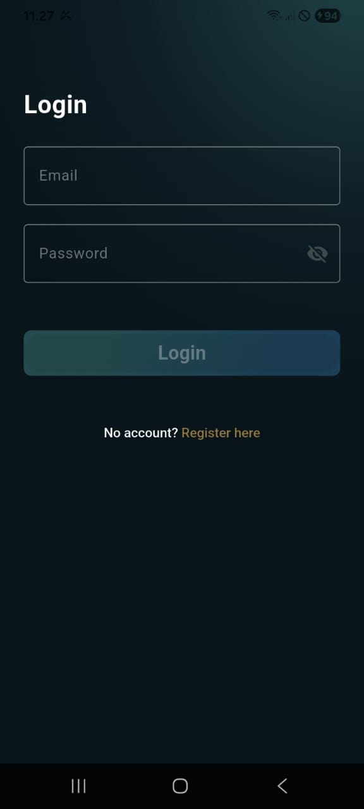
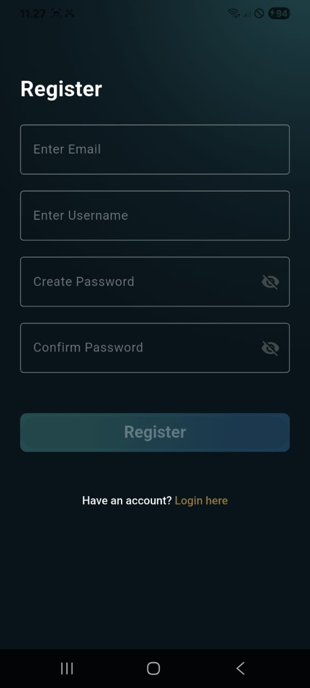
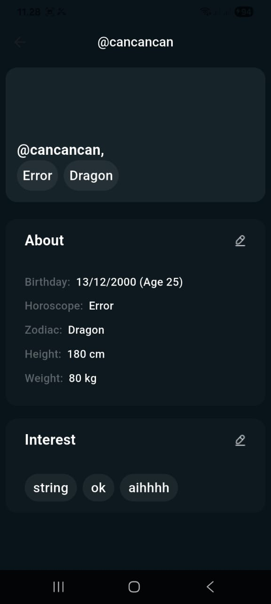
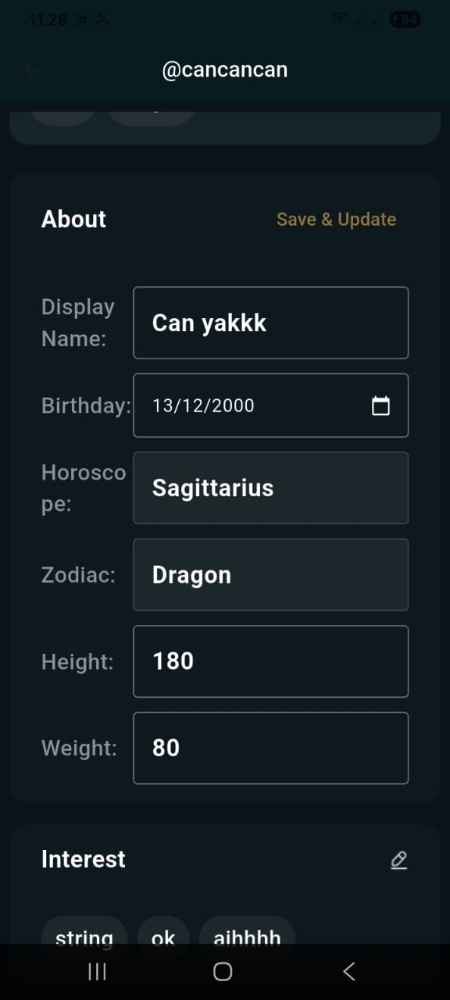
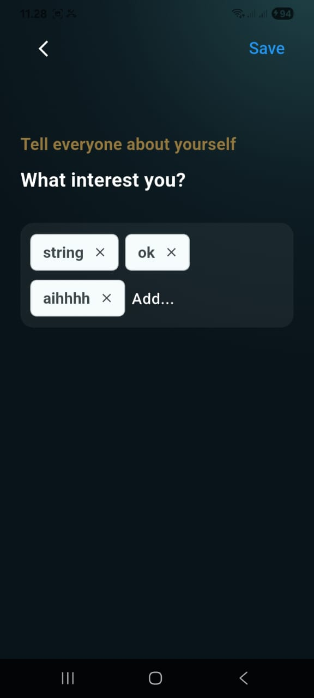

# YouApp

Aplikasi Flutter untuk kebutuhan autentikasi dan pengelolaan profil pengguna (About & Interests) dengan arsitektur berlapis (core/data/domain/presentation) dan state management `GetX`.

## Fitur Utama

- Login dan register pengguna.
- Simpan token autentikasi lokal menggunakan `get_storage`.
- Ambil, tampilkan, dan update data profil.
- Kelola data interest pengguna.
- HTTP client berbasis `Dio` dengan interceptor token.

## Screenshot

<p align="center">
	
	
	
	
	
</p>

## Tech Stack

- Flutter (SDK Dart `^3.9.2`)
- `get` (routing, dependency injection, state management)
- `dio` (HTTP client)
- `get_storage` (local storage)
- `mocktail` (unit testing)

## Struktur Proyek

```text
lib/
	core/
		bindings/       # dependency awal (TokenStorage, ApiClient)
		constants/      # konstanta API, warna, tema, assets
		error/          # exception/failure
		models/         # base model/entity
		network/        # dio client + interceptor
		storage/        # token storage
		utils/          # logger, helper lain
	data/
		datasources/    # akses API dan local datasource
		models/         # response model
		repositories/   # implementasi repository
	domain/
		entities/       # entitas domain
		repositories/   # kontrak repository
		usecases/       # business usecase
	presentation/
		bindings/       # DI per fitur
		controller/     # GetX controller
		pages/          # halaman UI
		widgets/        # reusable widget
	routes/
		app_pages.dart  # definisi route + binding
		app_routes.dart # konstanta nama route
```

## Alur Startup

Pada `lib/main.dart`, aplikasi melakukan inisialisasi berikut sebelum `runApp`:

1. `WidgetsFlutterBinding.ensureInitialized()`
2. `await GetStorage.init()`
3. Registrasi dependency awal melalui `InitialBinding`

Initial route saat ini mengarah ke `AppRoutes.login`.

## Endpoint API

Base URL didefinisikan di `lib/core/constants/api_constants.dart`:

`http://techtest.youapp.ai`

Endpoint utama:

- `/api/login`
- `/api/register`
- `/api/getProfile`
- `/api/updateProfile`

## Menjalankan Proyek

1. Install dependency:

```bash
flutter pub get
```

2. Jalankan aplikasi:

```bash
flutter run
```

3. (Opsional) analisis kode:

```bash
flutter analyze
```

## Testing

Struktur test yang tersedia:

- Unit test:
  - `test/data/repositories/auth_repository_impl_test.dart`
  - `test/domain/repositories/user_repository_test.dart`
- Widget test:
  - `test/presentation/pages/login_page_test.dart`
- Integration test:
  - `integration_test/auth_profile_flow_test.dart`

Jalankan semua test:

```bash
flutter test
```

Jalankan unit test saja:

```bash
flutter test test
```

Jalankan integration test saja:

```bash
flutter test integration_test
```

## Catatan Pengembangan

- Token auth dikelola terpusat lewat `TokenStorage` dan di-inject dari `InitialBinding`.
- `ApiClient` memakai `DioInterceptor` untuk menambahkan token ke request yang membutuhkan autentikasi.
- Gunakan binding per fitur (`AuthBinding`, `UserBinding`) agar dependency lifecycle terkelola dengan jelas.
